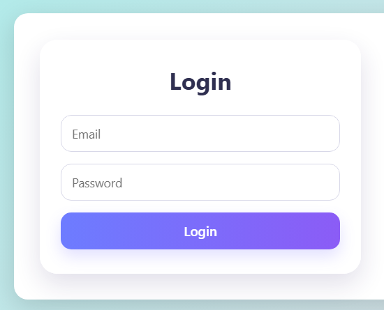
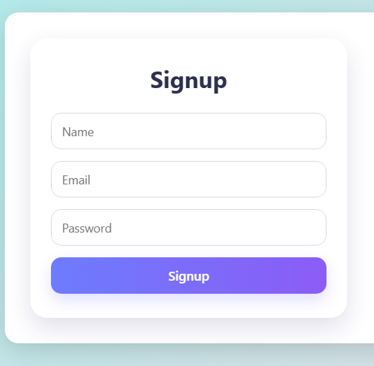
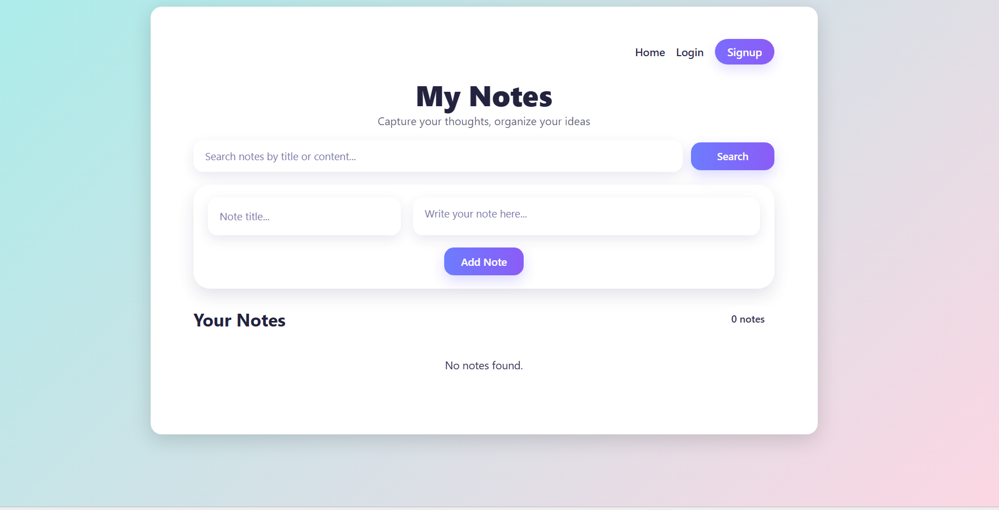
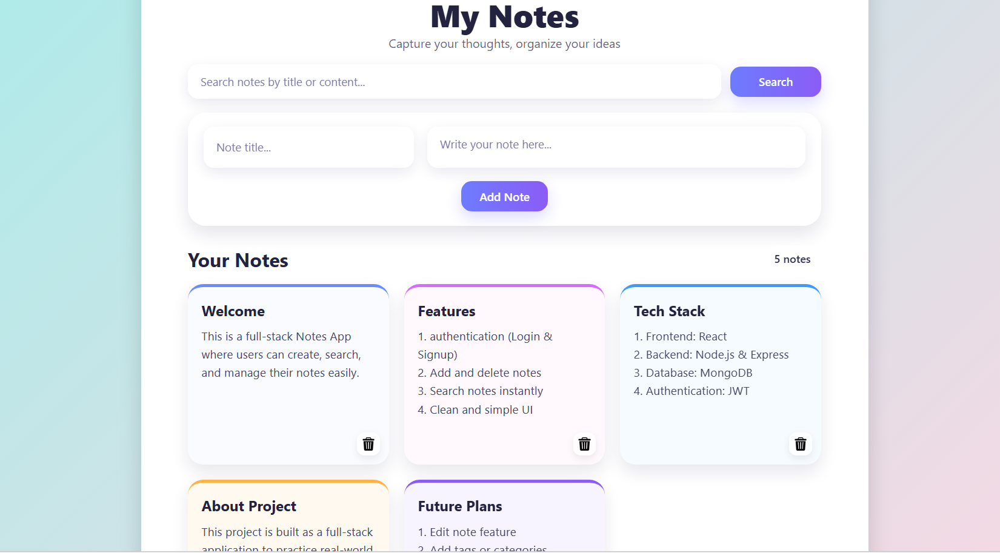

# 📝 Notes App

> A full-stack Notes application with authentication where users can create, search, and manage their notes.

---

## ✨ Features

* User authentication (Login & Signup)
* Add and delete notes
* Search notes by title or content
* Clean and responsive UI

---

## 📸 UI Preview

### 🔐 Login Page

A clean and minimal login interface for secure access.




---

### 🆕 Signup Page

Simple user registration with consistent UI design.



---

### 🏠 Notes Dashboard

The main workspace where users can:

* Create and manage notes
* Search notes instantly
* View structured note cards

#### 🧾 Notes Overview





---

## 🧠 Example Notes (as shown in UI)

* **Welcome**
  This is a full-stack Notes App where users can create, search, and manage their notes easily.

* **Features**
  Authentication, add note, delete note, and search functionality.

* **Tech Stack**
  React, Node.js, Express, MongoDB, JWT Authentication.

* **How to Use**
  Signup or login, start adding notes, search them, and delete when needed.

---

## 🛠️ Tech Stack

* **Frontend:** React
* **Backend:** Node.js, Express
* **Database:** MongoDB
* **Authentication:** JWT

---

## 🚀 Getting Started

### Clone the repository

```bash
git clone https://github.com/alokbhagat971-bit/Notes-App.git
cd Notes-App
```

### Install dependencies

```bash
npm install
```

### Run the app

```bash
npm start
```

---

## 📌 Future Improvements

* Edit note functionality
* Tags / categories
* Improve UI/UX
* Deploy the application

---

## 🙌 Acknowledgement

This project was built to practice full-stack development and improve real-world problem solving skills.
